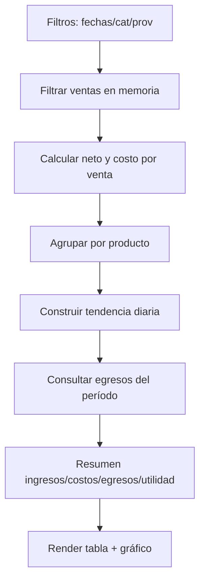

# Finanzas (Admin)

## Alcance

Se incorporan 2 módulos en el panel de administración:

- Análisis de ganancias: calcula ingresos por ventas vs costos de adquisición, y descuenta egresos operativos registrados en movimientos.
- Ingresos y egresos: registro de transacciones financieras con categorías, proveedores y comprobantes (archivo a Firebase Storage o URL).

## Permisos (RBAC)

- Admin:
  - Puede crear/editar productos, registrar movimientos, exportar reportes.
  - Puede administrar categorías y proveedores de movimientos.
- Vendedor:
  - No accede a estos módulos (bloqueado en UI).

Nota: al ser un frontend estático, el control real debe reforzarse con reglas de seguridad de Firestore y Storage.

## Estructura de datos (Firestore)

### productos

Campos relevantes para ganancias:

- codigo: string
- nombre: string
- stock: number
- precio_venta: number
- precio_compra: number
- categoria: string (opcional)
- proveedor: string (opcional)
- creadoEn: Date

### ventas

Campos relevantes para ganancias y EERR:

- codigo: string
- nombre: string
- cantidad: number
- precio_unitario: number
- costo_unitario: number
- descuento_monto: number
- impuesto_monto: number
- total: number
- fecha: Date/Timestamp
- rol: string
- vendedor: string
- fuente: string

Regla de cálculo usada:

- base = precio_unitario * cantidad
- neto = base - descuento_monto + impuesto_monto
- costo = costo_unitario * cantidad

### fin_categorias

- nombre: string
- creadoEn: Date

Uso:

- Clasificación de movimientos (ej. Compras, Servicios, Nómina, Gastos operativos).

### fin_proveedores

- nombre: string
- creadoEn: Date

Uso:

- Proveedor asociado al movimiento (opcional).

### fin_movimientos

- tipo: "ingreso" | "egreso"
- fecha: Date
- monto: number
- cuenta: string (Caja, Banco, Yape, etc.)
- categoria: string (opcional)
- proveedor: string (opcional)
- impuesto_monto: number (opcional)
- descuento_monto: number (opcional)
- descripcion: string (opcional)
- comprobante_url: string (opcional)
- comprobante: object | null (opcional)
  - path: string (ruta Storage)
  - url: string (download URL)
  - name: string
  - size: number
  - type: string
- creadoEn: Date
- actualizadoEn: Date
- actor: object
  - rol: string
  - nombre: string
  - user_id: string
  - usuario: string

### audit_logs

- action: string (create/update/delete)
- col: string (nombre de colección)
- docId: string
- before: object | null
- after: object | null
- ts: Date
- actor: object (rol/nombre/user_id/usuario)

## Validaciones

### Productos

- nombre requerido
- stock >= 0
- precio_venta >= 0
- precio_compra >= 0

### Movimientos

- tipo requerido (ingreso/egreso)
- monto > 0
- cuenta requerida
- comprobante (archivo) máximo 8MB

## Reportes

### Análisis de ganancias

Entradas:

- desde/hasta
- filtro por categoría/proveedor del producto (si existe en el producto)

Salidas:

- Ingresos: suma de neto de ventas en el período
- Costos: suma de costo de ventas en el período
- Egresos op.: suma de egresos (fin_movimientos tipo=egreso) en el período
- Utilidad: ingresos - costos - egresos op.
- Tendencia (línea): utilidad bruta por día
- Tabla: margen por producto (ingresos/costos/utilidad/margen)

Exportación:

- Excel: resumen + margen por producto
- PDF: vía impresión del navegador (Imprimir → Guardar como PDF)

### Ingresos y egresos (EERR)

Períodos:

- Rango (desde/hasta)
- Mensual (año/mes)
- Trimestral (año/trimestre)
- Anual (año)

Comparativo:

- Opcional: compara contra el período inmediatamente anterior del mismo tamaño.

Estado de resultados (resumen):

- Ventas netas (desde ventas)
- Costo de ventas (desde ventas)
- Utilidad bruta
- Otros ingresos (movimientos tipo=ingreso)
- Gastos/Egresos (movimientos tipo=egreso)
- Utilidad neta

## Flujos (Mermaid)

### Registrar movimiento

```mermaid
flowchart TD
  A[Admin ingresa formulario] --> B{Validaciones}
  B -- OK --> C[Crear fin_movimientos]
  C --> D{¿Adjunta archivo?}
  D -- Sí --> E[Subir a Firebase Storage]
  E --> F[Actualizar fin_movimientos.comprobante]
  D -- No --> G[Guardar URL (opcional)]
  F --> H[Registrar audit_logs]
  G --> H
  H --> I[Actualizar reporte / tabla]
  B -- Error --> X[Mostrar error]
```

### Calcular ganancias



## Mockups (wireframe textual)

### Análisis de ganancias

- Panel izquierda (Filtros)
  - Desde / Hasta
  - Categoría (select)
  - Proveedor (select)
  - Botones: Calcular | Excel | PDF
- Panel derecha (Resumen)
  - KPIs: Ingresos | Costos | Egresos op. | Utilidad
  - Gráfico: línea por día
- Abajo
  - Tabla: margen por producto (cant/ingresos/costos/utilidad/margen)

### Ingresos y egresos

- Panel izquierda (Registrar)
  - Tipo, fecha
  - monto, cuenta
  - categoría, proveedor
  - impuesto, descuento
  - descripción
  - comprobante: archivo o URL
- Panel derecha (Reporte)
  - Período (rango/mensual/trimestral/anual)
  - Opción comparar período anterior
  - KPIs: ingresos/egresos/neto/impuestos
  - Tabla: estado de resultados
- Abajo
  - Mantenimientos: categorías / proveedores
  - Tabla movimientos del período (con eliminar)

